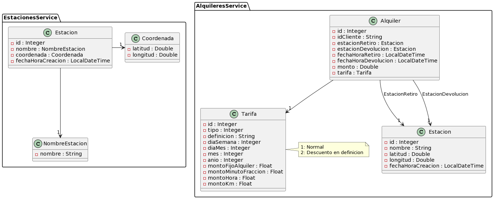
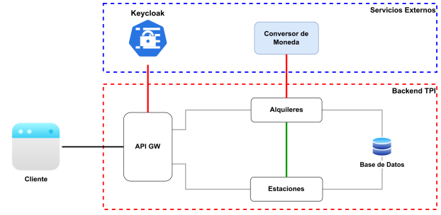
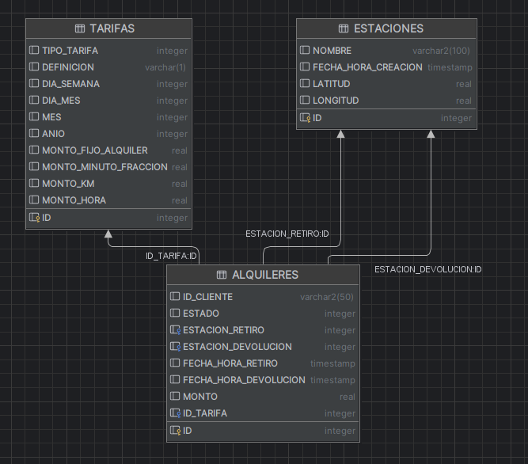

# Trabajo Práctico Integrador - Backend de Aplicaciones 2023

Este repositorio contiene el código fuente para el desarrollo del backend de un sistema de alquiler de bicicletas para una ciudad específica.

## Descripción del Proyecto

El sistema de alquiler de bicicletas sigue ciertos supuestos y reglas, entre ellos:

- **Clientes:** Solo los clientes registrados pueden alquilar bicicletas.
- **Bicicletas:** Cada bicicleta se retira de una estación y se devuelve en otra.
- **Disponibilidad:** Se asume que siempre hay una bicicleta disponible en cada estación.
- **Cálculo de Precio:** El precio del alquiler se calcula al devolver la bicicleta según reglas específicas, como costos fijos, costos por hora, costos por kilómetro, y descuentos en días promocionales.
- **Moneda:** El cliente elige la moneda en la que desea ver el importe adeudado al devolver la bicicleta.

## Funcionalidades

### Estaciones

1. **Consultar Estaciones:** Obtener el listado de todas las estaciones disponibles en la ciudad.
2. **Estación más Cercana:** Consultar los datos de la estación más cercana a una ubicación proporcionada por el cliente.
3. **Agregar Estación:** Agregar una nueva estación al sistema.

### Alquileres

4. **Iniciar Alquiler:** Iniciar el alquiler de una bicicleta desde una estación específica.
5. **Finalizar Alquiler:** Finalizar un alquiler en curso, proporcionando datos del mismo y el costo expresado en la moneda elegida por el cliente.
6. **Consultar Alquileres:** Obtener un listado de los alquileres realizados aplicando, al menos, un filtro.

## Roles y Autenticación

- **Administrador:** Puede agregar nuevas estaciones y obtener listados sobre los alquileres realizados.
- **Cliente:** Puede realizar consultas sobre las estaciones, realizar alquileres y devoluciones.

## Desarrollo y Consideraciones

- El backend presenta un único punto de entrada a través de un API Gateway.
- Se proporciona una base de datos para su utilización.
- Todas las llamadas a los endpoints requieren autenticación de clientes.
- El uso correcto de códigos de respuesta HTTP es esencial.
- Todos los endpoints deben estar documentados utilizando Swagger.

## Organización de los Servicios

## Base de Datos

### Diagrama de Entidades

### Tablas

1. **Estaciones:**
    - `ID`: Identificador de la estación
    - `NOMBRE`: Nombre de la estación
    - `FECHA_HORA_CREACION`: Fecha y Hora de creación de la estación
    - `LATITUD`: Latitud de la ubicación de la estación
    - `LONGITUD`: Longitud de la ubicación de la estación

2. **Tarifas:**
    - `ID`: Identificador de la tarifa
    - `TIPO_TARIFA`: Tipo de tarifa (1 - Normal, 2 - Descuento)
    - `DEFINICIÓN`: Definición de la tarifa (‘S’ - Día de la semana, ‘C’ - Día, mes y año)
    - `DIA_SEMANA`: Día de la semana para la tarifa semanal
    - `DIA_MES`: Día del mes para la tarifa diaria
    - `MES`: Mes para la tarifa mensual
    - `ANIO`: Año para la tarifa anual
    - `MONTO_FIJO_ALQUILER`: Monto fijo por iniciar el alquiler
    - `MONTO_MINUTO_FRACCION`: Monto por minuto fraccionado
    - `MONTO_HORA`: Monto por hora completa
    - `MONTO_KM`: Monto por kilómetro entre estaciones

3. **Alquileres:**
    - `ID`: Identificador del alquiler
    - `ID_CLIENTE`: Identificador del cliente que realizó el alquiler
    - `ESTADO`: Estado del alquiler (1 - Iniciado, 2 - Finalizado)
    - `ESTACION_RETIRO`: ID de la estación donde se retiró la bicicleta
    - `ESTACION_DEVOLUCION`: ID de la estación donde se devolvió la bicicleta
    - `FECHA_HORA_RETIRO`: Fecha y Hora del retiro de la bicicleta
    - `FECHA_HORA_DEVOLUCION`: Fecha y Hora de la devolución de la bicicleta
    - `MONTO`: Monto cobrado por el alquiler
    - `ID_TARIFA`: ID de la tarifa utilizada para calcular el monto del alquiler

## Distancia entre Estaciones

La distancia entre dos estaciones se calcula simplemente usando la distancia euclídea entre ambos puntos, donde cada grado corresponde a 110000 metros.

## Colaboradores

- Matías Ezequiel Gil
- Alejandro Axel Molina
